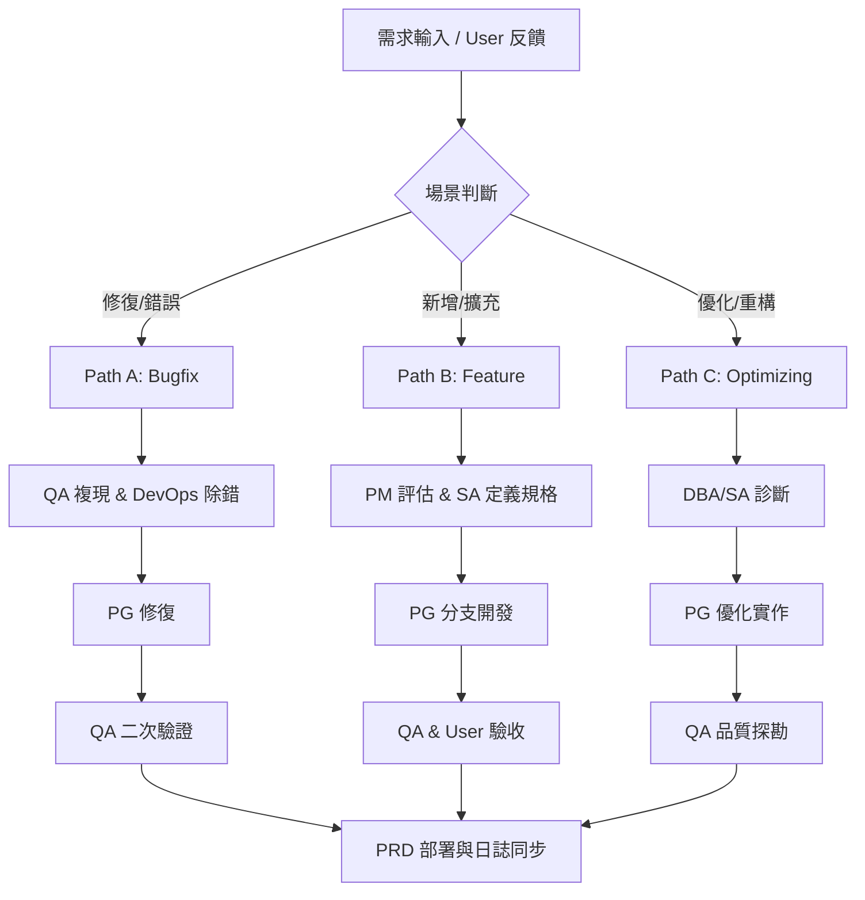

# Linkora - 專案交付與業務架構手冊 (Project Handbook)

本手冊旨在說明 Linkora v3.1.8 的核心業務邏輯、系統操作流程、權限架構與後台管理規範，供維運與後續功能擴展參考。

---

## 1. 核心業務流程 (Business Workflow)

Linkora 的營運核心在於「資源探勘 (Mining)」、「自動聯繫 (Outreach)」與「委外對帳 (Wholesale Billing)」的閉環。

1.  **資源探勘 (Auto-Miner)**: 
    - 使用者輸入關鍵字，AI 自動擴展並由 **Zen-studio 探勘引擎** 執行異步任務。
    - **全域隔離池 (Global Isolation Pool)**：優先從資料庫中同步已匹配資料，若不足則發動異地探勘。
    - 任務日誌記錄於資料庫，支援隨時斷點重啟或結果回溯。

2.  **開發聯繫 (Outreach Automator)**: 
    - 系統支援多封發信分組。
    - 結合 **AI 標籤分析**，自動將 `{{company_name}}` 等變數替換為個人化內容。
    - 發信任務自動注入 **Pixel 追蹤碼**，數據會即時回傳至分析儀表板。

3.  **委外對帳 (Wholesale Billing Logistics)**: 
    - 針對「委外廠商 (Vendor)」所屬成員 (Member) 產出的有效資料進行統計。
    - Admin 後台可設定各廠商的「Lead 批發單價」。
    - 儀表板自動核算當月帳單。

---

## 2. 系統角色與權限 (RBAC Architecture)

| 角色 (Role) | 權限範圍 | 核心頁面 |
| :--- | :--- | :--- |
| **👑 Admin** | 全域監控、API Key 管理、廠商 CRUD、全站參數配置 | `Admin Hub`, `Vendor Management` |
| **🏭 Vendor** | 團隊管理、查看旗下 Member 的總產量與應帳金額 | `Team Analytics`, `Member Management` |
| **👷 Member** | 第一線操作：探勘任務、模板編寫、發信執行 | `Lead Engine`, `Email Campaign` |

---

## 3. 技術架構細節 (Architecture Deep-Dive)

### 後端核心 (FastAPI)
- `auth.py`: 實作 **Cookie-based Session** 與 **Bearer Token** 雙重驗證機制，滿足 Web UI 與 External API 的不同需求。
- `email_sender_job.py`: 使用 **APScheduler** 維護一組可動態重啟的發信佇列，並具備 Retry 邏輯。
- `manufacturer_miner.py`: v3.1.8 現代化驅動，支援 Bing / Google CSE 的 Fail-over 備援切換。

### 前端架構 (Vite + React)
- `/src/contexts/AuthContext.tsx`: 管理全域登入狀態與角色緩存。
- `/src/components/RoleGuard.tsx`: 頁面與組件級別的權限過濾器。

---

## 4. 資料庫架構 (DB Schema Summary)

| 資料表 | 說明 | 關鍵欄位 |
| :--- | :--- | :--- |
| **users** | 核心帳號表 | `role` (admin/vendor/member), `vendor_id` |
| **leads** | 潛在客戶名單 | `user_id`, `company_name`, `contact_email`, `status` |
| **global_leads** | 全域隔離池原始庫 | `domain`, `raw_data_json`, `last_scraped_at` |
| **email_campaigns** | 行銷任務紀錄 | `subject`, `template_id`, `status` (Draft/Sent) |
| **email_logs** | 成效追蹤細項 | `opened_at`, `clicked_at`, `ip_address` |

---

## 5. 維運與故障排除 (Ops & Troubleshooting)

- **日誌追蹤**：系統核心日誌會緩存於 `backend/logger.py` 中，並可透過 `/api/system-logs` 即時獲取。
## 5. 職能協作與任務路由 (Task Routing & Collaboration)

為了確保需求從「輸入」到「驗收」能自動化流轉，Linkora 採用以下決策模型：

> [!TIP]
> 具體自動化判定邏輯與各階段 SOP 連結，請參閱 **[WORKFLOW_ENGINE.md](docs/WORKFLOW_ENGINE.md)**。

---
*Generated by Antigravity AI - Linkora v3.1.8 Documentation Support*
